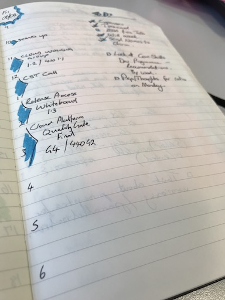

# Start of day checklists
- [ ] Capture schedule for the day
- [ ] Understand ToDo List items due today
- [ ] Realistically consider available time
- [ ] Capture today's ToDo List
- [ ] Set a mission for the day

## How the list can be used

Stuff changes all of the time, it's one of the few constants in life.  Much of my time is spent reacting to things, whilst also trying to juggle the commitments I have made to others.  To help me deal with this I combine a couple of techniques:  
- I use bits from Getting Stuff Done - like having trusted list in [Remember the milk (RTM)](https://www.rememberthemilk.com)
- I try to get things out of my head, so write stuff down in my notebook
- I also take inspiration from the [Emergent Task Planner](https://davidseah.com/node/the-emergent-task-planner/) from [David Seah](https://www.davidseah.com)

So at the start of the every day, typically whilst commuting, I:
__Capture schedule for the day__  
_I fire up my calendar and capture it in my notebook._

__Understand ToDo List items due today__  
_I take a look at RTM and capture the things that I must do today.  They are things I have committed to deliver for others, or promises made to myself._

__Realistically consider available time__  
_I then take a look at my schedule, and the committed ToDo list items and ask myself how much time am I going to get to give attention to other things on the ToDo list_

__Capture today's ToDo List__  
_If appropriate I will add to the ToDo list for today, if not I won't._

__Set a mission for the day__  
_It is also quite uplifting and rewarding to set yourself a mission for the day.  Specify these in terms of something that you have achieved - it will become self fulfilling.  E.g. "Today I have practiced active listening techniques."_

So that is it - 10 mins and I have a game plan for the day.  I know and am comfortable that some, or a good part of it will change, and that's OK.  I will do what I can to deliver on the commitments I have made, but won't beat myself up if I fail to complete other items on the ToDo list for the day. 
